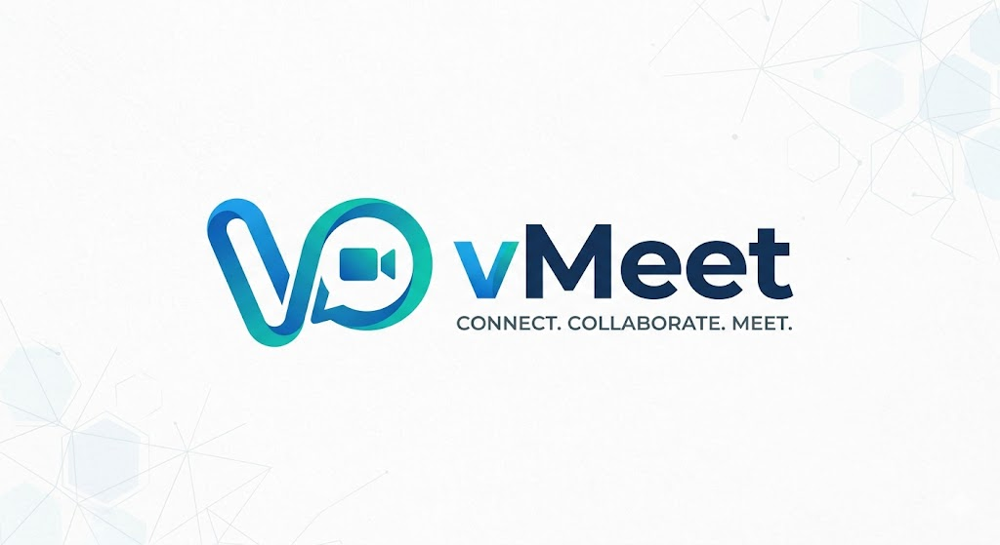
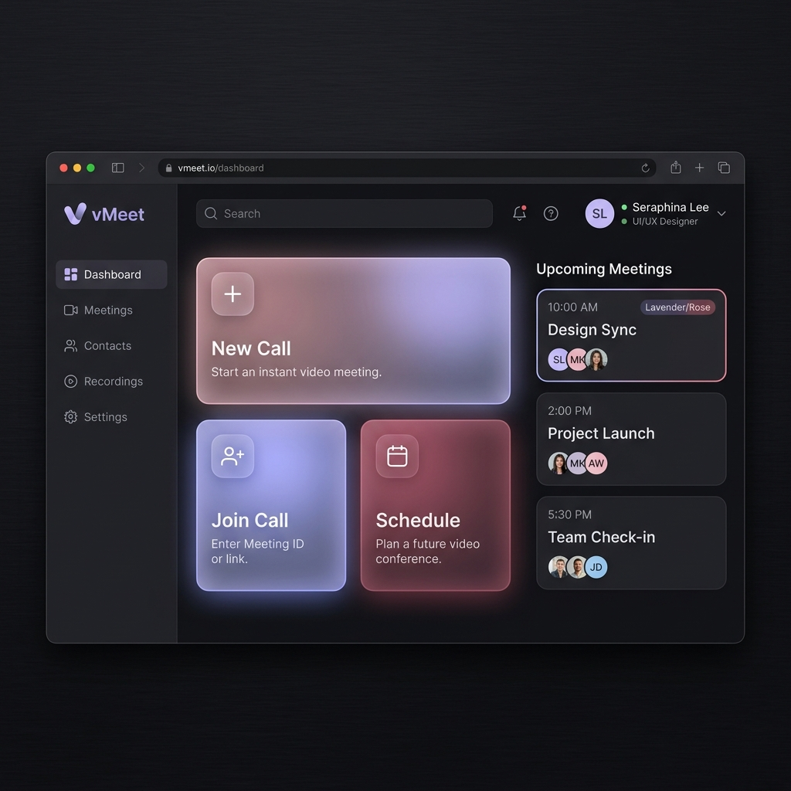

# 💜 vMeet - Premium Video Conferencing App

<p align="center">
  
</p>

vMeet is a premium, cross-platform video conferencing application built with Flutter and powered by **Jitsi Meet**. Featuring a sleek, custom-designed **Warm Twilight** theme with rich glassmorphism UI, soft gradient palettes, and ambient glow effects, vMeet delivers an exceptional first impression and a smooth, comfortable user experience.

---

## 📸 App Showcase

### Beautiful Dashboard & Meeting Spaces
<p align="center">
  
</p>

---

## ✨ Features

- 🎨 **Warm Twilight Theme:** Custom visual identity featuring a curated Deep Lavender and Dusty Rose color scheme, soft glowing blobs, and premium vector typography (Outfit font).
- 🎥 **Jitsi Meet Video Engine:** Fast, encrypted, high-quality video and audio conferencing without complex backend token servers.
- 📱 **Unified Multiplatform Call Architecture:** Conditional compiling connectors that bridge native platforms:
  - **Android/iOS:** Uses the native `jitsi_meet_flutter_sdk` wrapper.
  - **Web:** Uses a dynamic, custom-built Jitsi External API Script Injector running in a sandboxed iframe.
- 🛡️ **Graceful Web Permission Handling:** Customized permissions utility that manages camera and microphone access natively while bypassing dependencies on Web to prevent runtime exceptions.
- 🔄 **Robust Teardown Guards:** State-monitored web iframe wrapper prevents Jitsi's double close events from triggering double-pop route exceptions.
- 👤 **Custom Avatar Designer:** Interactive, twilight-themed personal avatar generator and customizable nicknames.
- 🗂️ **Meeting History & Schedules:** Keep track of recent calls and upcoming schedules inside a beautiful sliding tab feed.

---

## 🛠️ Configuration & Jitsi Server Swap

You can easily point vMeet to a private, enterprise, or JaaS (Jitsi as a Service) server to bypass the default 5-minute meeting limit warning.

Edit the configuration in [lib/core/config/jitsi_config.dart](file:///d:/Android_App_Development/Video_Conference/lib/core/config/jitsi_config.dart):

```dart
class JitsiConfig {
  // Replace with your own server domain, e.g. "my-jitsi.domain.com"
  static const String serverUrl = "meet.jit.si";
}
```

The app dynamically pulls this domain to:
1. Load the corresponding `external_api.js` script tag on Web dynamically.
2. Initialize native plugins on Android/iOS with the custom domain wrapper.

---

## 🚀 Getting Started

### Prerequisites
- [Flutter SDK](https://docs.flutter.dev/get-started/install) (v3.19.0 or higher recommended)
- Android Studio / VS Code with Dart & Flutter plugins
- Xcode (for iOS builds, macOS required)

### Setup & Run

1. **Clone the repository:**
   ```bash
   git clone https://github.com/Rejuyan/Video_Conference_App.git
   cd Video_Conference_App
   ```

2. **Install dependencies:**
   ```bash
   flutter pub get
   ```

3. **Run the application:**
   - **For Web:**
     ```bash
     flutter run -d chrome
     ```
   - **For Android/iOS:**
     ```bash
     flutter run
     ```

---

## 👨‍💻 Developer Signature

This project is built and maintained with 💜 by **Rejuyan**.

- **GitHub:** [@Rejuyan](https://github.com/Rejuyan)
- **Signature inside the app:** Both the **Onboarding Screen** and the **Dashboard Screen** include the developer signature footer: `Made with 💜 by Rejuyan`.

---

*Made with love and dedication to premium software experiences.*
